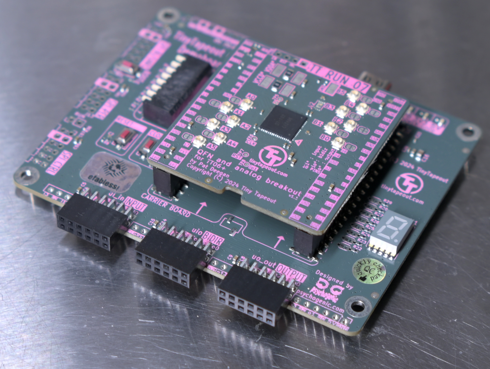
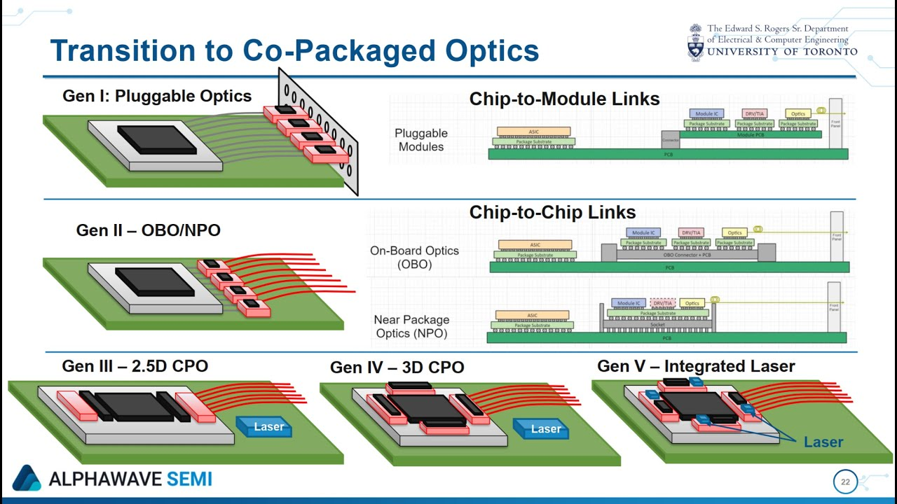
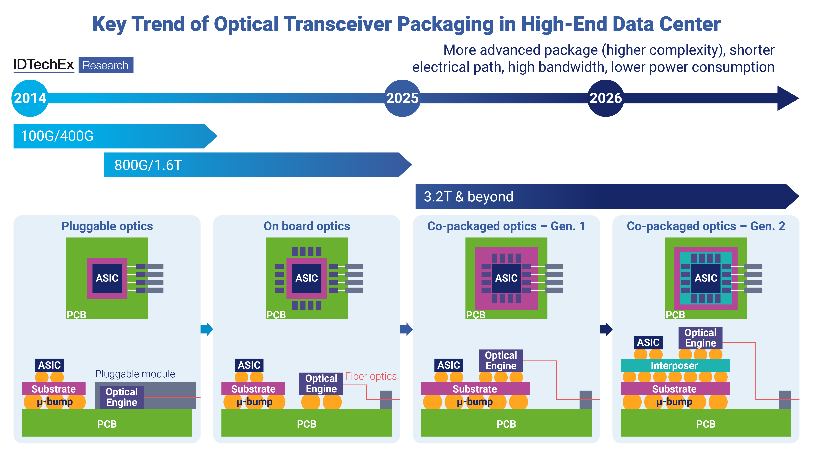
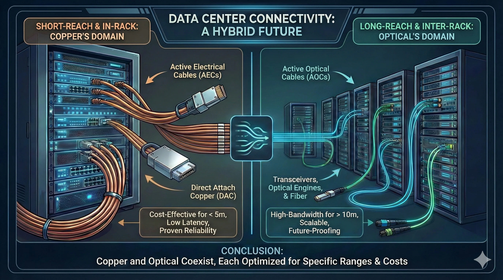
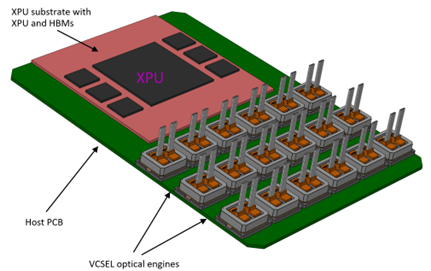
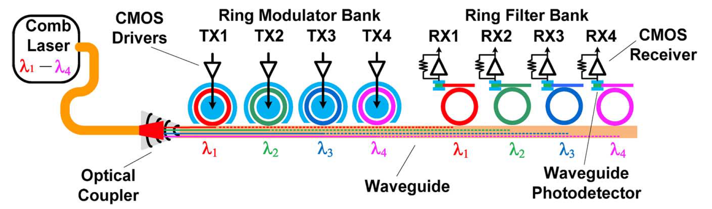

   

# Tiny Tapeout Verilog Project: Distributed Computing with Pong!

### Just watch it in action!

<video src="src\debug_history\checkpoint5_unstable_teleport_after_3\checkpoint5.mp4" controls width="100%">
  Your browser does not support the video tag.
</video>

### Two chips. One game. No seams.

Two chips frankensteined together to act as one.
* The left chip owns the left half.
* The right chip owns the right half.

They talk through wires and pass the ball back and forth like one seamless chip.

Just like AI data centers split math across thousands of processors, these two chips split a game of Pong – passing ball physics between two screens.

## How It Works

The playing field is split cleanly across two hardware chips:

*   **Left Chip:** Controls the left half of the screen.
*   **Right Chip:** Controls the right half of the screen.

When the ball reaches the screen boundary, the active chip passes it to the other chip, which continues the game seamlessly on its half.

The ball maintains the exact same direction and speed, making the screens look like one single continuous playing field.

| Connection State | Behavior |
| --- | --- |
| Connected | Ball flows seamlessly left ↔ right |
| Disconnected | Ball bounces off edge like a normal wall |
| Reconnect | Right screen ball disappears, left screen keeps playing |

The chips don't just pass the ball blindly - they do a handshake to pass the ball's position and speed through the bidirectional pin with a communication protocol.

* When the ball reaches to the edge of the screen, it got detected and hold the ball in place.

* It records the ball physics while holding it and send a message to another chip.

* If it fails to pass, it just hold until it receive, if it got disconnected, it resumes and bounces the ball as the portal collapse.

* When the another chip got the message, it sends back a roger to complete the handshake move.

* It renders the ball and resumes its physics in its own screen.

* After sending the ball and received a rodger, it deletes the ball as the another chip got the ball.

It continues moving in the same direction at the same speed, as if the screens were actually stitched to one big continuous playing field.

## Why This Matters?

This project demonstrates **distributed computing** in action—multiple computers working together on a single task.

#### But wait, what is the difference from a normal multiplayer game?

* Most multiplayer games use a **server-client model** – one central server controls everything. Server dies? Game over for everyone.

* This works like **cryptocurrency** – completely decentralized. Both chips see the same game world and agree on what's happening, stitching their screens into one giant seamless display.

### **The Core Principles**

#### 1. True Decentralization
* No master. No slave. No single point of failure.

* Both chips run the exact same design. Both are equals.

* **Two chips, one world. No boss. No server. Just cooperation.**

#### 2. Parallelism (Like AI Chips)
* Instead of one chip doing all the work, two chips split the job, share results, and keep playing—even when parts fail.

* This is the same principle powering massive AI chips: splitting work across many smaller processors to solve problems no single chip could handle alone.

#### 3. Self-Healing from Data Corruption
But here's the real kicker: **self-healing**. 
*   One chip dies? The other keeps playing alone. No crash. No reset. It just works. 
*   Reconnect the dead chip? They rebuild the world and resync instantly. No manual intervention. No restart. The system heals itself.

**That's true fault tolerance — the core of distributed computing. Pong just makes it fun to watch.**

&nbsp;

## Made Possible by Tiny Tapeout

This project wouldn't exist without **Tiny Tapeout** – the platform that makes chip design accessible to everyone.

### The Backstory: From Zero to Silicon

The author learned about chip design at an amazing workshop hosted by [Pat Deegan](https://www.youtube.com/@PsychogenicTechnologies) at [Latch-Up 2026](https://fossi-foundation.org/latch-up/2026) – a conference dedicated to free and open source silicon by ([FOSSi Foundation](https://fossi-foundation.org/)).

The [Tiny Tapeout](https://tinytapeout.com/) workshop showed that anyone can design and fabricate a chip.

* Inspired by that experience, the author decided to build something wild: distributed computing on a tiny chip. A proof that parallelism and fault tolerance aren't just for AI data centers – they can run on two crappy frankensteined chips playing Pong.

### **From zero to tapeout in 7 days**

**No prior chip design experience.** Just curiosity, and a stubborn belief that it could be done by a nobody.

For the sake of the author's bigger end goal:

>**Project Yeouibu**
>
>* Building a world-class semiconductor empire in the most underrated smartest city in the world, Waterloo Canada
>
>* Turning it into a beacon of global innovation through a special economic zone initiative.
([Article](https://www.linkedin.com/feed/update/urn:li:activity:7440488589068566529/?utm_source=share&utm_medium=member_desktop&rcm=ACoAAD8EX30BDpb0W0uJlx1NSad0ZRf28OHpHgE))
>   

### **100+ hours of work**

Watching the same sunrise 4 times in the last sprint of the 1 week marathon - **from noobie workshop to tape it out**

The author **self-taught** everything: 

From Distributed Computing, Network Protocols, Signal Processing, Hardware Descriptive Language (HDL), Chip Design, to Game Design. Just by pure thinking!

Fun to learn by doing. Fun to invent solutions from just solving the problem, no terminology, no spoiler. **All from pure reasoning**.

### If the author can do it, **so can you**.

Whether you want to build AI accelerators, distributed systems, or just play Pong across two chips – Tiny Tapeout is your starting line.

### **Learn. Build. Tape out.**

&nbsp;

# Future Development

#### Many features are planned but couldn't fit due to lack of experience and time. What exists now is the bare minimum – a proof of concept. But the foundation is solid. The potential is huge.

## 1. Scalable Network Chaining with Consensus

The current design supports two chips. The next evolution: **connect as many chips as you want**.

With 8 bidirectional pins, ball and connection status can be condensed into the UART protocol. Each chip can be designed and optimized to talk to all its neighbors using 4 pairs of UART pins.

### Network Topology in TinyTapeOut

With 8 bidirectional pins, each chip can talk to all its neighbors using 4 pairs of UART pins. Each chip builds its local network map based on which pin numbers are connected. By summing the connection numbers reported by its neighbors, each chip calculates a **vote**. These votes are broadcast to everyone, allowing the network to assign unique IDs and build a global map.

**Every chip agrees on who holds the ball and how it's passed – just like cryptocurrency!**

### Consensus Voting with Asymmetric Pin Mapping (The Voting Mechanism)

This is the hard part of distributed computing – building trust among chips so they believe what another chip says is true.

Using my game analogy to illustrate: automatic identification as proof-of-concept showcasing how this can be done in modern AI/data center chips.

Given the constraint that every chip shares identical hardware and software, they cannot identify themselves uniquely. UART pair pin numbers can be utilized to create asymmetry for consensus voting.

Each chip follows the connection rule below to connect with every other chip using **its relative pin pair positions**, creating unique vote values.

| Chip | Pair 1-2 | Pair 3-4 | Pair 5-6 | Pair 7-8 |
|------|---------|---------|---------|---------|
| **A** | B | C | D | E |
| **B** | A | C | D | E |
| **C** | A | B | D | E |
| **D** | A | B | C | E |
| **E** | A | B | C | D |

### How Voting Works (Pin Position = Weight)

During booting iteration, each chip declares a vote – the connection pin number – to every other chip in the network.

| Chip | Pair 1-2 | Pair 3-4 | Pair 5-6 | Pair 7-8 |
|------|---------|---------|---------|---------|
| **A** | B = 1 | C = 2 | D = 3 | E = 4 |
| **B** | A = 1 | C = 2 | D = 3 | E = 4 |
| **C** | A = 1 | B = 2 | D = 3 | E = 4 |
| **D** | A = 1 | B = 2 | C = 3 | E = 4 |
| **E** | A = 1 | B = 2 | C = 3 | D = 4 |

In the next iteration, every chip has received votes from all its active connections. Each chip calculates its **vote sum**:

| Chip | Votes from neighbors | Vote Sum |
|------|---------------------|----------|
| A | B(1) + C(1) + D(1) + E(1) | **4** |
| B | A(1) + C(2) + D(2) + E(2) | **7** |
| C | A(1) + B(2) + D(3) + E(3) | **9** |
| D | A(1) + B(2) + C(3) + E(4) | **10** |
| E | A(1) + B(2) + C(3) + D(4) | **10** |

Each chip broadcasts its vote. All chips collect every vote and sort them:

| Vote | Chip | ID |
|------|------|-----|
| 4 | A | 0 (left edge) |
| 7 | B | 1 |
| 9 | C | 2 |
| 10 | D | 3 |
| 10 | E | 4 (right edge) |

*If there is a tie, both chips join together as a team with the same ID – left as an exercise for the player to figure out team formation with port configuration.*

### The Global Map

Now every chip knows:
1. Who it is connected to
2. What its neighbors are connected to
3. Its position in the local network based on the voted sum

When a chip gets disconnected, it can simply repeat the voting process and re-identify itself and its local network following the connection rule as a global source of truth, or just reseated from its missing slot of the local network map for a simplier route.

Player could also optimize all of the voting combination to fit more than 5 chips, left as a logic exercise for the player if they have more than 5 players. The author would be impressed if anyone manages to gather so many people to play it.

**Add more chips. Build a wall. Make a stadium. The game grows with your hardware.**

## 2. ICBM Mechanics

After the infrastructure is done, the next thing is to make the game fun!

As the author spent hefty time and heavily inspired by Maplestory and GregTech (Minecraft mod about real-life industrial processes), the author has been thinking about building a game out of that concept. The next feature: player controls a jet with its own maneuver mechanics. Player can shoot ICBMs with a cooldown to another player's local map through the physics transfer demonstrated in this Pong prototype.

Portals spawn chaotically, indicated by color for connected pairs, where ICBMs are transported from attacker to target dimension (inspired by modern Maplestory boss mechanics). The ICBM bounces indefinitely until it crosses another portal or is destroyed by the player.

If an ICBM is destroyed by another ICBM not originating from that space, it triggers a deadly cross beam (parallel and perpendicular from the destroyed ICBM's trajectory and center), posing danger and penalty to the player. If two ICBMs not originating from local space collide, they form 2 deadly crosses based on the collision direction – introducing chaotic dynamics where players choose between attack and defense. If a player is destroyed, all ICBMs originated by that player disappear until the last man stands.

However, based on the current minimal proof-of-concept code, it already occupies 2 tile spaces from Tiny Tapeout. Implementation is unlikely – the author believes this is enough to demonstrate the distributed computing concept.

&nbsp;

# Beyond a Silly Game: The Future of Chip-to-Chip Communication

Distributed computing relies heavily on chip-to-chip communication. The current bottleneck for AI/data center chips is **power** and the **shoreline** – the physical edge where massive amounts of parallel data enter and exit the chip.

In this game, interconnect between chips is demonstrated through jumper wires between bidirectional pins on a PMOD socket. In real modern chips, the high-speed data paths rely on ultra-fine copper traces or optical transceivers to route data – but this has already reached its physical limit.

### Where the Industry Is Today

To minimize the physical distance between computation and communication, the industry is transitioning toward Co-Packaged Optics (CPO), which integrates optical routing components directly into the chip package.

*Source: "Co-Packaged Optics for our Connected Future." YouTube, uploaded by [Microelectronics], 2024. [Video]. Available: https://www.youtube.com/watch?v=Xt-GY8Pkt6g*

*Source: Chang, Y.H. "Co-Packaged Optics (CPO) 2026-2036: Technologies, Market, and Forecasts." IDTechEx, 2025. [Report]. Available: https://www.idtechex.com/en/research-report/co-packaged-optics-cpo/1138*

The architectural roadmap is clear: **Pluggable modules → ASIC → Direct Substrate Integration**

### The Problem: Neither Copper Nor VCSEL Scales to Sub-TeraHz

To achieve sub-TeraHz data rates, we must evaluate the limitations of the two dominant interconnect technologies used today.

*Source: Blackburn, C. "The 400G-Per-Lane Inflection Point: Where Copper and Optical Meet in AI Infrastructure." Astera Labs, 2024. [White paper]. Available: https://www.asteralabs.com/the-400g-per-lane-inflection-point-where-copper-and-optical-meet-in-ai-infrastructure/*

While copper is a cost-effective and reliable solution for short-reach signaling, it hits a rigid physical wall between 400G and 800G per lane, rendering it incapable of supporting sub-TeraHz frequencies. Beyond these speeds, signal quality degrades exponentially due to the AC skin effect, As current becomes confined to this thin outer layer, microscopic surface roughness forces it to travel a longer effective path, significantly increasing AC resistance.

Even worse, once the signal leaves the die, the plastic packaging and circuit board materials absorb high-frequency energy and turn it into heat. At sub-TeraHz speeds, the wires themselves act like a filter that kills the signal, or worse, like antennas that broadcast noise everywhere. This is why optical fibers are so attractive: light has no electrical charge, so signals don't interfere with each other. Copper simply cannot go faster without burning too much power, needing complex electronics, or turning into a radio transmitter.

**VCSELs** (Vertical-Cavity Surface-Emitting Lasers) are the industry standard for optical transceivers. They convert electricity to light using tiny lasers embedded in the chip. But this approach has deep flaws. While VCSELs is highly reliable within hot-swappable pluggable modules, integrating VCSELs directly onto a high-performance compute substrate introduces single-point-of-failure vulnerabilities; a single laser failure ruins the entire multi-thousand-dollar ASIC package, causing unacceptable system downtime.

Furthermore, direct modulation of VCSELs causes severe wavelength chirp and suffers from fundamental RC parasitic bottlenecks. This restricts them to binary or basic PAM4 signaling, capping single-lane speeds well below the sub-TeraHz data rates required by next-generation links. Structurally, because VCSELs consist of alternating, planar Distributed Bragg Reflector (DBR) mirrors grown parallel to the substrate, they emit light vertically. This vertical profile prevents them from cleanly coupling into flat, planar photonic waveguides without complex, high-loss 90-degree turning mirrors. This geometric mismatch, combined with their inability to support high-density Wavelength Division Multiplexing (WDM) in a single bus waveguide, establishes VCSELs as an inadequate, short-range intermediate solution.

*Source: Broadcom Inc. "Beyond the Copper Wall: Scaling AI Clusters with VCSEL-Based Near-Package Optics." 2024.*

If anyone wants to build the next generation of interconnect, photonics is not an option – it becomes a necessity. But VCSELs are not the answer.

# The Author's Research

This project went from a workshop concept to final tapeout in a single, intense one‑week sprint from nothing. Far from an end goal, this milestone represents a beginning. It let the author get hands-on experience building optical communication, from simple jumper wires to photonics, with the ultimate goal of building a substrate-level optical transceiver capable of **revamping the backbone of chip communication.**

Instead of embedding lasers inside the chip, my research moves the light source **off-chip** using an **external frequency comb** delivers light to the substrate via **photonic wire bonding**. The optical signal is then routed directly to an on-chip array of **Microring Resonators** (MRRs), which are made of **non-linear optical materials** like **Thin Film Lithium Niobate (TFLN)** and **Barium Titanate Oxide (BTO)** - explained in the process.

*Source: Saiham, D., Wu, D., & Rahman, S. "Leveraging photonic interconnects for scalable and efficient fully homomorphic encryption." arXiv preprint arXiv:2506.12962, Jun. 2025. DOI: 10.48550/arXiv.2506.12962. Available: https://arxiv.org/abs/2506.12962*

#### The Physics: Why Pockels Effect Beats Laser Modulation

Traditional VCSELs work by turning a laser on and off as fast as possible. But switching a laser on and off has hard limits – it is slow, generates heat, and eventually cannot go any faster.

This design takes a completely different approach. It uses **evanescent coupling** between MRRs to capture the optical signal from the bus waveguide through resonance. The ring is designed to be exactly the right size so that light of a specific wavelength resonates inside it, bouncing around thousands of times.

When the ring resonates, it traps that wavelength. Light does not pass through the bus waveguide, representing an "off" state.

To modulate this signal, a localized voltage is applied across the ring's non-linear optical cladding. This triggers the linear electro-optic (Pockels) effect, which instantaneously alters the material's refractive index. Changing the refractive index alters the effective optical path length of the ring. This shifts the microring's resonance frequency away from the laser’s wavelength, breaking the coupling condition. The light no longer enters the ring and instead travels unhindered down the bus waveguide — representing an "on" state.

The key is that this voltage-driven index change happens in **picoseconds** – a thousand times faster than a nanosecond. Pure electrical control of light, ready to be exploited to develop the next generation of optical transceivers.

This is the breakthrough that enables sub‑TeraHz modulation.

#### The Design: External Frequency Comb + MRR Array

Instead of embedding lasers on-chip, a single external frequency comb produces many wavelengths simultaneously. Here is how it works.

1. Injection: the frequency comb injects a C‑band (capable of long-distance transfer) with regularly spaced spectral lines into a single bus waveguide via photonic wirebonding. Each discrete spectral line serves as an independent data channel.

2. Modulation: an array of MRRs sits alongside the shared waveguide, with each individual ring tuned to resonate with one specific wavelength from the comb. When no voltage is applied, the MRR resonates at that frequency and blocks the light – a logical 0. When voltage is applied to trigger the Pockels effect, the resonance frequency shifts and light passes through – a logical 1.

3. Parallel Multiplexing: The independently modulated, multi-coloured data channels travel concurrently down the single, shared waveguide across the chip, board, or server rack.

4. Demodulation: A matching receiver array of MRRs, paired with integrated high-speed photodetectors, filters and reads each wavelength channel in parallel.

**By leveraging the Pockels effect, the resonance frequency shifts deliberately to mismatch the optical channel wavelength – allowing transmission. This enables signals to be densely packed within a single bus waveguide, unlocking parallel, low-latency data routing across chips, boards, and racks.**

#### The Materials: TFLN and BTO

For the photonic layer of the MRR array, the industry have been developing two kind of nonlinear optical materials.

**Thin Film Lithium Niobate (TFLN)** is mature, silicon‑compatible, and thermally conductive. It has an excellent Pockels coefficient and helps remove heat from the CMOS driver.

**Barium Titanate Oxide (BTO)** While still primarily in the research and development phase, BTO offers a significantly higher Pockels coefficient than TFLN, delivering unmatched energy efficiency for electro-optic conversion.

Both are excellent candidates for sub‑THz communication. The fabrication challenge, specifically etching uniformity and high-quality thin-film deposition remain persistent. But that is the opportunity, not the obstacle.

#### Integration: Photonic Layer on CMOS BEOL

The photonic layer is wafer‑bonded directly to the Back‑End‑of‑Line (BEOL) of the CMOS driver/receiver die. This integration achieves several things.

The non-linear photonic layer is wafer-bonded directly to the Back-End-of-Line (BEOL) layers of the CMOS driver and receiver die. This monolithic integration achieves several critical design goals:

Thermal Isolation: Thermal energy from the primary light source never enters the compute die, confining on-chip thermal dissipation strictly to the CMOS logic itself—which is further mitigated by TFLN’s high thermal conductivity.

Zero Laser Dead-Time: – The laser stays on continuously. No waiting for it to turn on and off. Switching happens entirely through voltage, not laser cycling.

Elimination of Single-Point Failures: Shifting the active laser cavities off-chip ensures the multi-wavelength comb source remains entirely hot-swappable and field-replaceable.

True Optical Parallelism: Multiple optical channels signal propagate simultaneously through a single waveguide. Because the routing architecture relies entirely on passive evanescent coupling inside a microring rather than destructive electrical manipulation, the multi-wavelength bus waveguide can be routed freely across the system architecture without significant risk of signal degradation or of material breakdown.

### The Vision

This design delivers **superior communication infrastructure** compared to VCSEL and pure electrical signaling.

A vertically integrated **Electronic‑Photonic Integrated Circuit (EPIC)** fab is a worthwhile investment in today's technology landscape. These architectures are gaining increasing attention in both academia and industry – and they represent the only path forward for sub‑TeraHz data transfer.

**From jumper wires to light. From one chip to many. The next step is ours to build.**

### Author's Current Task list

| Task | Status |
|------|--------|
| Athermal MRR Array Simulation and Optimization | On Hold |
| 7nm CMOS FinFET Process CAD Modeling | On Hold |
| DRAM Process CAD Modeling (Co-Developing In-Game DRAM Process Recipes for [SuperSymmetry](https://susymodpack.substack.com/p/3-circuit-overhaul)) | Work in Progress |
| Complete Circuit Design for the EPIC | On Hold |
| Develop Minimal Viable Layout Schematics of the EPIC | On Hold |
| [**2026 Chipathon**](https://sscs.ieee.org/technical-committees/tc-ose/sscs-pico-design-contest/) | Current next task |

### This Project as Distributed Computing Proof-of-Concept

This silly Pong game is more than just a game. It demonstrates:

- **Chip-to-chip trust** – Two identical chips negotiating who is left and right
- **Fault tolerance** – One chip dies? The other keeps playing
- **Self-healing** – Reconnect and they rebuild the world automatically
- **Decentralized consensus** – No master, no slave. Just equals cooperating.

The same principles scale from two chips playing Pong to thousands of chips in an AI data center. The math changes. The concept stays the same.

---

### A Word from the Author

The author has been working on this project alone and has run into many life challenges. Nobody believed a "nobody" and also would be crazy enough to attempt for a fight for world-class semiconductor empire. So the author bit the bullet and tanked all the losses as personal fault.

This silly Pong game? It's a stupid prototype. A desperate attempt to prove that this could work. To convince people that one person who have nothing to do in life but with a dream and 100+ hours within a week can make something real.

**If you're interested – even just curious – I'd love to chat.**
Connect with me on [LinkedIn](https://www.linkedin.com/in/timllh/).
---

### References

1. Broadcom Inc. (2024). Beyond the Copper Wall: Scaling AI Clusters with VCSEL-Based Near-Package Optics (NPO). *Broadcom Blog*. https://www.broadcom.com/blog/beyond-the-copper-wall-scaling-ai-clusters-with-vcsel-based-near-package-optics-npo

2. Blackburn, C. (2024). The 400G-Per-Lane Inflection Point: Where Copper and Optical Meet in AI Infrastructure. *Astera Labs*. https://www.asteralabs.com/the-400g-per-lane-inflection-point-where-copper-and-optical-meet-in-ai-infrastructure/

3. Chang, Y.H. (2025). Co-Packaged Optics (CPO) 2026-2036: Technologies, Market, and Forecasts. *IDTechEx*. https://www.idtechex.com/en/research-report/co-packaged-optics-cpo/1138

4. Co-Packaged Optics for our Connected Future. (2024). YouTube. https://www.youtube.com/watch?v=Xt-GY8Pkt6g

5. Saiham, D., Wu, D., & Rahman, S. (2025). Leveraging photonic interconnects for scalable and efficient fully homomorphic encryption. *arXiv preprint arXiv:2506.12962*. https://arxiv.org/abs/2506.12962

### Why This Matters for Pong

This tiny Pong game – two chips passing a ball across jumper wires – is a **microcosm** of the same challenge facing the largest AI data centers. The same principles apply:

- Chip-to-chip trust
- Distributed consensus
- Bandwidth limits
- Fault tolerance

**What started as a game becomes a prototype for the future of computing.**

## What is Tiny Tapeout?

Tiny Tapeout is an educational project that aims to make it easier and cheaper than ever to get your digital and analog designs manufactured on a real chip.

To learn more and get started, visit https://tinytapeout.com.

## Set up your Verilog project

1. Add your Verilog files to the `src` folder.
2. Edit the [info.yaml](info.yaml) and update information about your project, paying special attention to the `source_files` and `top_module` properties. If you are upgrading an existing Tiny Tapeout project, check out our [online info.yaml migration tool](https://tinytapeout.github.io/tt-yaml-upgrade-tool/).
3. Edit [docs/info.md](docs/info.md) and add a description of your project.
4. Adapt the testbench to your design. See [test/README.md](test/README.md) for more information.

The GitHub action will automatically build the ASIC files using [LibreLane](https://www.zerotoasiccourse.com/terminology/librelane/).

## Enable GitHub actions to build the results page

- [Enabling GitHub Pages](https://tinytapeout.com/faq/#my-github-action-is-failing-on-the-pages-part)

## Resources

- [FAQ](https://tinytapeout.com/faq/)
- [Digital design lessons](https://tinytapeout.com/digital_design/)
- [Learn how semiconductors work](https://tinytapeout.com/siliwiz/)
- [Join the community](https://tinytapeout.com/discord)
- [Build your design locally](https://www.tinytapeout.com/guides/local-hardening/)

## What next?

- [Submit your design to the next shuttle](https://app.tinytapeout.com/).
- Edit [this README](README.md) and explain your design, how it works, and how to test it.
- Share your project on your social network of choice:
  - LinkedIn [#tinytapeout](https://www.linkedin.com/search/results/content/?keywords=%23tinytapeout) [@TinyTapeout](https://www.linkedin.com/company/100708654/)
  - Mastodon [#tinytapeout](https://chaos.social/tags/tinytapeout) [@matthewvenn](https://chaos.social/@matthewvenn)
  - X (formerly Twitter) [#tinytapeout](https://twitter.com/hashtag/tinytapeout) [@tinytapeout](https://twitter.com/tinytapeout)
  - Bluesky [@tinytapeout.com](https://bsky.app/profile/tinytapeout.com)
